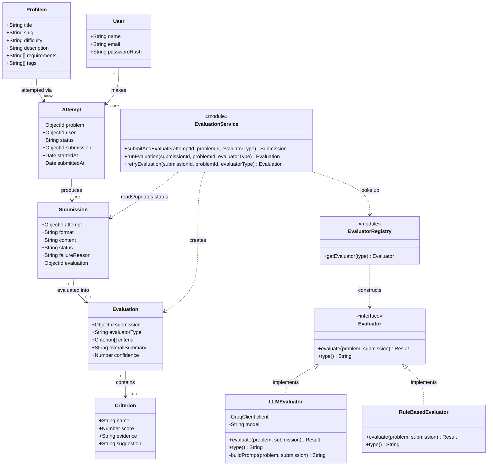
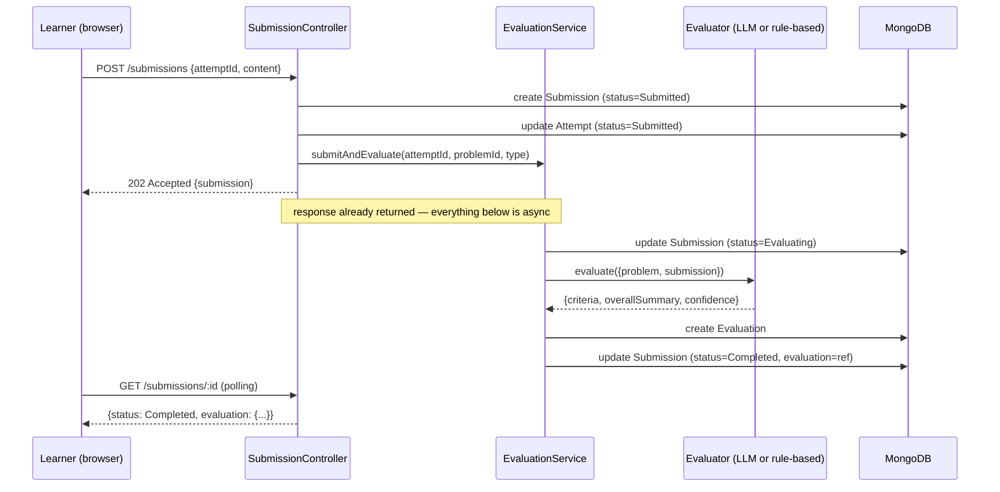
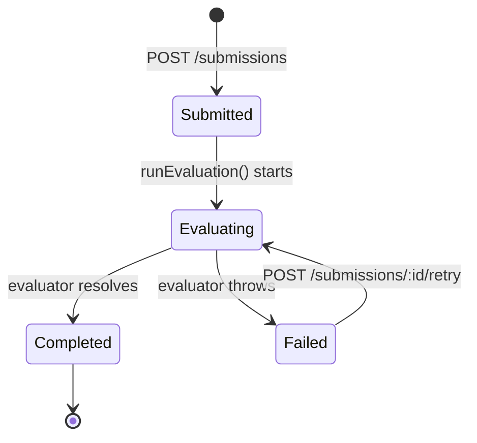

# Low-Level Design — LLD Practice Platform

This document is the LLD for the platform itself: every class/interface, its responsibilities, key method signatures, relationships, and the design decisions behind them. `DESIGN_NOTE.md` covers the product-level trade-offs; this file is the code-level reference.

---

## 1. Class diagram



**Reading the arrows:** solid diamond-less arrows (`-->`) are references (Mongo `ObjectId`s, not object composition — this is a document DB, not an in-memory object graph). Hollow-triangle dashed arrows (`<|..`) are interface implementation. Plain dashed arrows (`..>`) are dependency — a class that *uses* another without owning or extending it. `EvaluationService` depends on the `Evaluator` abstraction only; it never imports `LLMEvaluator` or `RuleBasedEvaluator` directly.

---

## 2. Class and interface reference

### 2.1 `Problem` (Mongoose model)

Static catalog entity. Owns nothing about any learner or attempt.

| Field | Type | Notes |
|---|---|---|
| `title` | String | Display name |
| `slug` | String | Unique, used in URLs |
| `difficulty` | Enum: `Easy \| Medium \| Hard` | |
| `description` | String | |
| `requirements` | String[] | Shown to the learner; also fed into the LLM prompt |
| `tags` | String[] | e.g. `["State Pattern"]` |

No behaviour beyond persistence — deliberately a plain data holder. All logic that *acts on* a `Problem` lives in `LLMEvaluator`/`RuleBasedEvaluator` or the controllers, not on the model itself.

### 2.2 `User` (Mongoose model)

| Field | Type | Notes |
|---|---|---|
| `name` | String | |
| `email` | String | Unique, lowercased |
| `passwordHash` | String | bcrypt hash — plaintext password never persisted |

### 2.3 `Attempt` (Mongoose model)

One learner's session against one `Problem`. The anchor for "History."

| Field | Type | Notes |
|---|---|---|
| `problem` | ObjectId → Problem | |
| `user` | ObjectId → User | |
| `status` | Enum: `InProgress \| Submitted` | |
| `submission` | ObjectId → Submission, nullable | Set once the learner submits |
| `startedAt` | Date | |
| `submittedAt` | Date, nullable | |

**Design decision:** retrying a problem creates a **new** `Attempt` rather than resetting an old one. This is what makes attempt history meaningful — every past `(Attempt, Submission, Evaluation)` triple is immutable and reviewable, not overwritten.

### 2.4 `Submission` (Mongoose model)

The evidence handed in. Owns the evaluation-lifecycle state machine.

| Field | Type | Notes |
|---|---|---|
| `attempt` | ObjectId → Attempt | |
| `format` | Enum: `text` (extend later) | Change Test A hook — see §7 |
| `content` | String | The learner's design write-up |
| `status` | Enum: `Submitted \| Evaluating \| Completed \| Failed` | State machine — see §4 |
| `failureReason` | String, nullable | Populated only when `status === Failed` |
| `evaluation` | ObjectId → Evaluation, nullable | Set once `status` reaches `Completed` |

### 2.5 `Evaluation` (Mongoose model)

Immutable verdict from one evaluator run. Deliberately its own document, not embedded in `Submission` — see §7.

| Field | Type | Notes |
|---|---|---|
| `submission` | ObjectId → Submission | |
| `evaluatorType` | String | `"llm"` \| `"rule-based"` \| future `"human"` |
| `criteria` | `Criterion[]` | Subdocument array — see 2.6 |
| `overallSummary` | String | |
| `confidence` | Number, 0–1 | |

### 2.6 `Criterion` (subdocument, embedded in `Evaluation`)

| Field | Type | Notes |
|---|---|---|
| `name` | String | e.g. `"Class Responsibilities"` |
| `score` | Number, 0–5 | |
| `evidence` | String | Must reference the actual submission, not be generic |
| `suggestion` | String | One concrete, actionable improvement |

Embedded (not its own collection) because criteria have no independent lifecycle — they only ever exist as part of one `Evaluation`.

### 2.7 `Evaluator` — the interface

```js
class Evaluator {
  async evaluate({ problem, submission }) {
    // returns { criteria: Criterion[], overallSummary: string, confidence: number }
  }
  get type() { /* "llm" | "rule-based" | ... */ }
}
```

This is the single extensibility seam in the whole system. Every scoring strategy — current or future — implements exactly this contract. `EvaluationService` calls `evaluate()` and nothing else; it never branches on which concrete evaluator it holds.

### 2.8 `LLMEvaluator implements Evaluator`

- Holds a Groq client and model name.
- `buildPrompt(problem, submission)` (private) constructs a **fixed six-dimension rubric prompt** (requirement understanding, class responsibilities, coupling/cohesion, encapsulation, abstraction, extensibility) requiring `evidence` + `suggestion` per dimension — deliberately not an open-ended "is this good?" prompt.
- `evaluate()` calls Groq with `response_format: json_object`, parses the result, and **defensively clamps** every score to `[0,5]` and truncates string lengths — the model's output is never trusted as-is.

### 2.9 `RuleBasedEvaluator implements Evaluator`

- No network calls. Two deterministic checks: submission length (word count) and whether any requirement keyword appears in the content.
- Exists for two reasons: (1) proves the `Evaluator` seam actually works with a second implementation, (2) gives the test suite a network-free evaluator so integration tests don't depend on a live LLM.

### 2.10 `EvaluatorRegistry` (module, `evaluators/index.js`)

```js
function getEvaluator(type = "llm") // → Evaluator instance
```

The single place that maps a string type to a concrete `Evaluator`. Adding a third evaluator = one new class + one new line in this registry — nothing else in the codebase changes.

### 2.11 `EvaluationService` (module, `services/evaluationService.js`)

Owns the async lifecycle. Does **not** implement scoring itself — delegates entirely to whatever `Evaluator` the registry hands it.

```js
submitAndEvaluate({ attemptId, problemId, evaluatorType }) // persists, returns immediately, fires evaluation in background
runEvaluation(submissionId, problemId, evaluatorType)       // Evaluating → Completed/Failed
retryEvaluation(submissionId, problemId, evaluatorType)     // re-runs on a Failed submission only
```

---

## 3. Sequence: submit → evaluate → feedback



The `202` return happens **before** the evaluator is ever called — this is the concrete mechanism behind "don't block the learner on a slow AI call."

---

## 4. State diagram: `Submission.status`



Guards enforced in code, not just implied by the diagram:

- A second `POST /submissions` on an `Attempt` that's already `Submitted` is rejected with `409` — prevents duplicate evaluation runs from a double-click or client retry.
- `retryEvaluation()` throws if called on anything other than a `Failed` submission — `Completed` and `Evaluating` are not retry-able.
- `failureReason` is only ever set on transition into `Failed`, and cleared implicitly by the next successful `Completed` transition (a new `Evaluation` document is created; the old failure is just history in the logs, not carried forward).

---

## 5. API surface (the interface contract exposed to the frontend)

| Method | Path | Auth | Maps to |
|---|---|---|---|
| POST | `/api/auth/register`, `/api/auth/login` | — | `User` |
| GET | `/api/problems`, `/api/problems/:slug` | — | `Problem` (read-only, public) |
| POST | `/api/attempts` | JWT | `startAttempt()` |
| GET | `/api/attempts`, `/api/attempts/:id`, `/api/attempts/problem/:problemId` | JWT | history views |
| POST | `/api/submissions` | JWT | `createSubmission()` → `EvaluationService.submitAndEvaluate()` |
| GET | `/api/submissions/:id` | JWT | polling target |
| POST | `/api/submissions/:id/retry` | JWT | `EvaluationService.retryEvaluation()` |

This table *is* the boundary between frontend and domain layer — the React app only ever talks to these seven endpoints and never touches Mongoose models or evaluator logic directly (`frontend/src/api/client.js`).

---

## 6. Design patterns in use

| Pattern | Where | Why it earns its place here |
|---|---|---|
| **Strategy** | `Evaluator` + `LLMEvaluator` / `RuleBasedEvaluator` | Direct mechanism for "accommodate another evaluation approach later" — swap/add a strategy without touching the service, routes, or schema |
| **State machine** | `Submission.status` | Turns "what if evaluation fails" into a modeled transition instead of an exception handled ad hoc |
| **Registry / simple factory** | `evaluators/index.js` | One lookup point from string → concrete `Evaluator`; keeps `EvaluationService` free of `if/else` on evaluator type |

Not used, deliberately: Observer, Command, Factory hierarchies, Decorator. None solved a real problem at this scope — adding them would be exactly the "patterns for their own sake" anti-pattern the brief warns against.

## 7. SOLID mapping

- **Single responsibility** — `Submission` owns lifecycle state; `Evaluation` owns the verdict. Kept as two documents specifically so neither has two reasons to change (a scoring-rubric change never touches `Submission`; a retry-policy change never touches `Evaluation`).
- **Open/closed** — `EvaluationService` is closed for modification when a new evaluator ships (never edited), open for extension via the registry.
- **Liskov substitution** — any `Evaluator` is a drop-in replacement for another; `EvaluationService` never type-checks which concrete class it received.
- **Interface segregation** — `Evaluator` exposes exactly one method (`evaluate`) plus a `type` getter; no unrelated persistence/notification methods bolted on.
- **Dependency inversion** — `EvaluationService` depends on the `Evaluator` abstraction, not on Groq or `LLMEvaluator` directly. Groq is a leaf implementation detail two layers down, swappable without touching the service.

## 8. Extension points — the two change tests, mapped to real classes

**Change Test A — new submission format (e.g. class diagram upload):**
`Submission.format` enum gains a new value → a new frontend input component → `LLMEvaluator.buildPrompt()` learns to serialize the new format into the prompt. `Attempt`, `Evaluation`, `EvaluationService`, and every route are untouched.

**Change Test B — new evaluator (rule-based, human review):**
Already proven, not just claimed: `RuleBasedEvaluator` sits beside `LLMEvaluator` behind the same `Evaluator` interface today. A `HumanReviewEvaluator` would implement the same `evaluate()` contract (its implementation would enqueue a review task and resolve when a reviewer submits a score) — `EvaluationService`'s `Submitted → Evaluating → Completed/Failed` flow needs zero changes.

## 9. What's intentionally *not* modeled (MVP scope)

- No `Rubric` class as a separate first-class entity — the six dimensions live as a constant inside `LLMEvaluator`. If multiple rubrics per problem type become a real need, that constant becomes a `Rubric` document referenced by `Problem`; nothing else in this diagram changes.
- No job-queue/worker classes — `EvaluationService.runEvaluation()` is a plain async function. `Submission.status` is already the durable checkpoint a real queue would need, so introducing one later is additive infrastructure, not a redesign.
- No `Notification`/`Reviewer` classes — out of scope until a `HumanReviewEvaluator` is actually built.
